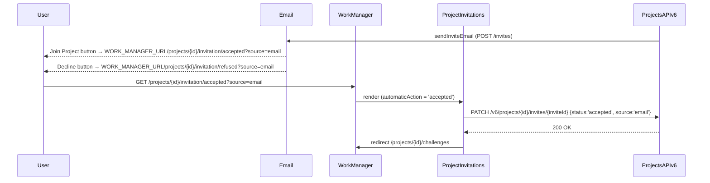

# Topcoder - Challenge Creation App UI

This is the frontend application for creating and managing challenges.

### Development deployment status
[](https://circleci.com/gh/topcoder-platform/challenge-engine-ui/tree/develop)

### Production deployment status
[](https://circleci.com/gh/topcoder-platform/challenge-engine-ui/tree/master)

## Intended use

- UI for creating challenges

## Related repos
- [Challenge API](https://github.com/topcoder-platform/challenge-api) - The API endpoint for challenges
- [Resources API](https://github.com/topcoder-platform/resources-api) - The API endpoint for resources
- [Projects API](?)
- [Challenge ES Processor](https://github.com/topcoder-platform/challenge-processor-es) - Updates challenge data in ElasticSearch
- [Resource ES Processor](https://github.com/topcoder-platform/resource-processor-es) - Updates resource data in Elasticsearch

## Prerequisites
-  [NodeJS](https://nodejs.org/en/) (v22+)
-  [Docker](https://www.docker.com/)
-  [Docker Compose](https://docs.docker.com/compose/)

## Configuration

Production configuration is in `config/constants/production.js`
Development configuration is in `config/constants/development.js`

## Project Invitation Flow

### Route handled

`/projects/:projectId/invitation/:action?`

Handled by `ProjectInvitations` container (`src/containers/ProjectInvitations/index.js`).

### Email link format

When `projects-api-v6` sends an invite email to a **known user** (existing Topcoder account), the email contains two action buttons whose links must use this exact format:

| Button | URL |
| --- | --- |
| Join Project | `{WORK_MANAGER_URL}/projects/{projectId}/invitation/accepted?source=email` |
| Decline Invitation | `{WORK_MANAGER_URL}/projects/{projectId}/invitation/refused?source=email` |

- `{WORK_MANAGER_URL}` is the `WORK_MANAGER_URL` env var configured in `projects-api-v6`.
- The `?source=email` query parameter is forwarded in the `PATCH /v6/projects/{projectId}/invites/{inviteId}` body as `{ status, source }`.

### Automatic action behaviour

When a user clicks either link and lands on the route with `:action` set, `ProjectInvitations` automatically calls `updateProjectMemberInvite` without showing the confirmation modal. After success it redirects to:

- `accepted` → `/projects/{projectId}/challenges`
- `refused` → `/projects`

### Manual (modal) flow

When the route is accessed **without** an `:action` segment (e.g., navigating directly to `/projects/{projectId}/invitation`), the container shows a `ConfirmationModal` with **Join project** / **Decline** buttons.

### API call made

Both flows call `PATCH /v6/projects/{projectId}/invites/{inviteId}` via `updateProjectMemberInvite` in `work-manager/src/services/projectMemberInvites.js`, with body `{ status: 'accepted' | 'refused', source?: 'email' }`.

### Env var cross-reference

`WORK_MANAGER_URL` is documented in the `projects-api-v6` README under Environment Variables. Ensure it is set to the deployed work-manager origin (no trailing slash), e.g.:

- Dev: `https://challenges.topcoder-dev.com`
- Prod: `https://work.topcoder.com`

### Sequence diagram



## Local Deployment Instructions

1. First install dependencies

```bash
pnpm install
```

2. copy the environment file in docs/dev.env to /.env

3. If you are using local instances of the API's, change the DEV_API_HOSTNAME in configs/constants/development.js to match your local api endpoint.
    - For example change it to 'http://localhost:3000/',

4. Run the app in development mode

```bash
pnpm run start:dev
```

You can access the app from [http://localhost:5000/](http://localhost:5000/)

The page will reload if you make edits.

You will also see any lint errors in the console.

### Lint check

To test the app for lint errors

```bash
pnpm run lint
```

*Use the `--fix` flag to automatically fix errors.*

## Production deployment

To build the app for production

```bash
pnpm run build
```

Builds the app for production to the `build` folder.

It correctly bundles React in production mode and optimizes the build for the best performance.

The build is minified and the filenames include the hashes.

If you want to test to production build locally you can run

```bash
npm install -g serve
serve -s build
```

It serves the build folder locally.

### Heroku Deployment

To deploy the app on heroku run

```bash
git init
heroku create tc-challenge-creation-app --buildpack mars/create-react-app
git add .
git commit -m "Heroku commit"
git push heroku master
```

You can access the app by running

```bash
heroku open
```

## Running tests

### Configuration

Test configuration is at `config/env.js`. You don't need to change them.
for testing run below command

```bash
npm run test
```

## Running tests in CI
- TBD

## Verification
- TBD
